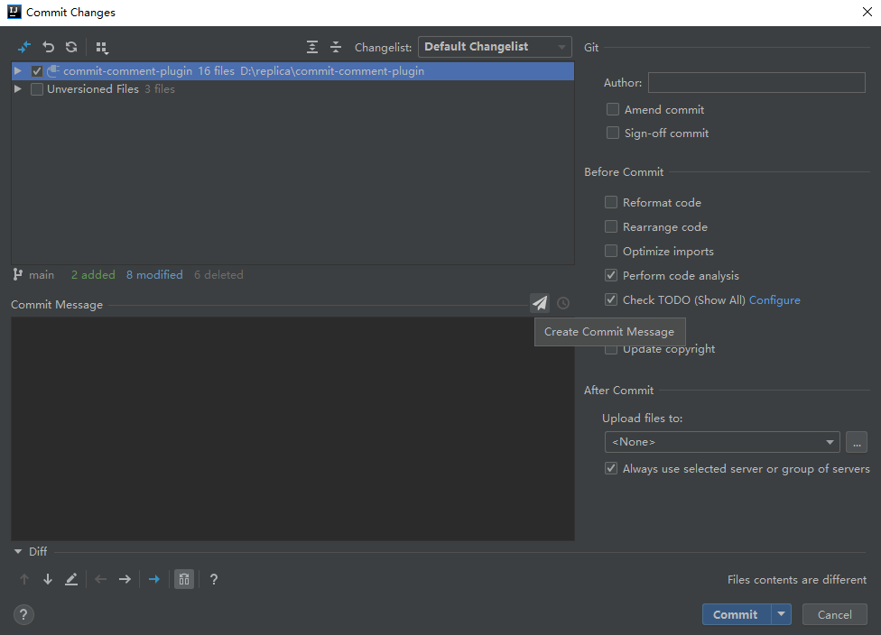
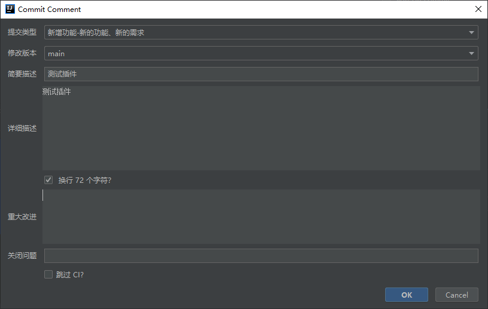
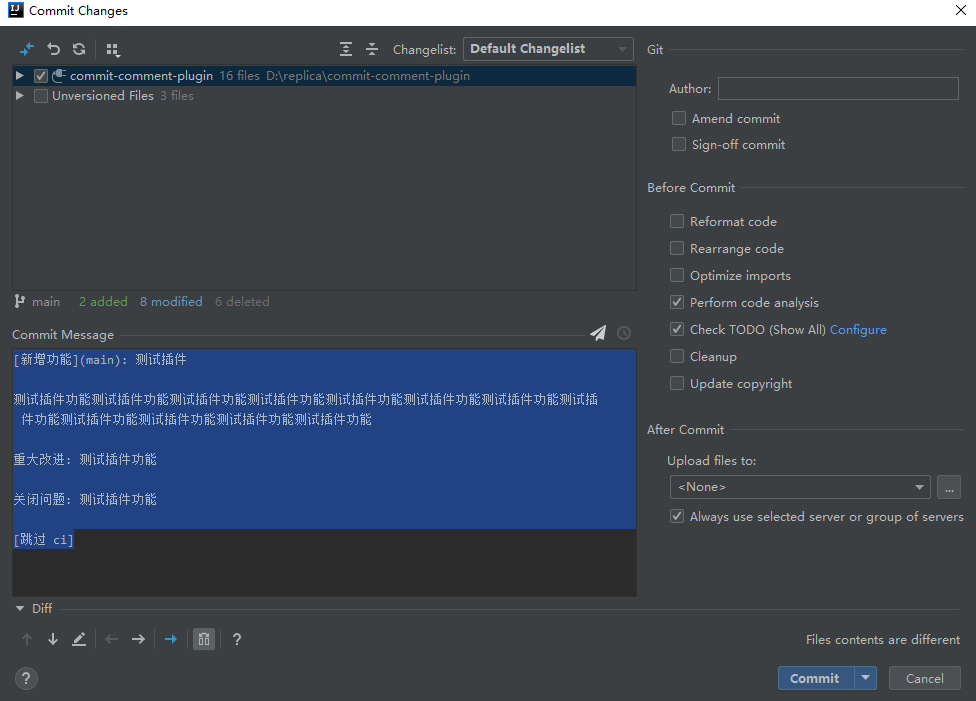

# Commit Comment Plugin

> git代码提交规范模板插件

## 一、代码提交信息规范模板

**模板规范来自[Angular代码提交规范](https://github.com/angular/angular.js/blob/master/CONTRIBUTING.md#commit-message-format)**

#### 1.提交类型

- [新增功能]-新的功能、新的需求
- [Bug修复]-修复代码Bug(测试、验收等阶段的Bug)
- [代码完善]-开发自测过程中遗漏的代码逻辑
- [文档修改]-仅文档更改(代码注释、README等)
- [样式修改]-不影响代码功能的修改 (CSS样式、代码格式化等)
- [代码重构]-既不修复错误也不添加功能的代码更改
- [性能优化]-提高性能的代码更改
- [测试代码]-添加缺失的测试或更正现有的测试
- [编译代码]-影响构建系统或外部依赖项的更改(示例：yarn、npm)
- [持续集成]-对 CI 配置文件和脚本的更改(示例：Jenkinsfile、gitlab-ci、Dockerfile)
- [代码回退]-恢复之前的提交，代码回滚
- [其他更改]-不修改代码或测试文件的其他更改

#### 2.修改版本

默认使用分支名称，可手动修改

#### 3.简要说明

一句话简单的描述下提交代码的功能作用

#### 4.详细描述

详细的描述下提交代码的功能作用

#### 5.重大改进

一般用于大版本更新，代码重构等。

#### 6.关闭问题

关联issues

## 二、IDEA插件安装

直接从 IDE 插件管理器安装 (File > Settings > Plugins > Marketplace > Commit Comment)

## 三、用法

## 感谢

此插件借鉴了 Damien Arrachequesne 作者[Git Commit Template](https://plugins.jetbrains.com/plugin/9861-git-commit-template)插件的代码，并对其进行了汉化和简单的布局修改。

## License

Licensed under the Apache License, Version 2.0 (the "License");
you may not use this file except in compliance with the License.
You may obtain a copy of the License at

   http://www.apache.org/licenses/LICENSE-2.0

Unless required by applicable law or agreed to in writing, software
distributed under the License is distributed on an "AS IS" BASIS,
WITHOUT WARRANTIES OR CONDITIONS OF ANY KIND, either express or implied.
See the License for the specific language governing permissions and
limitations under the License.
